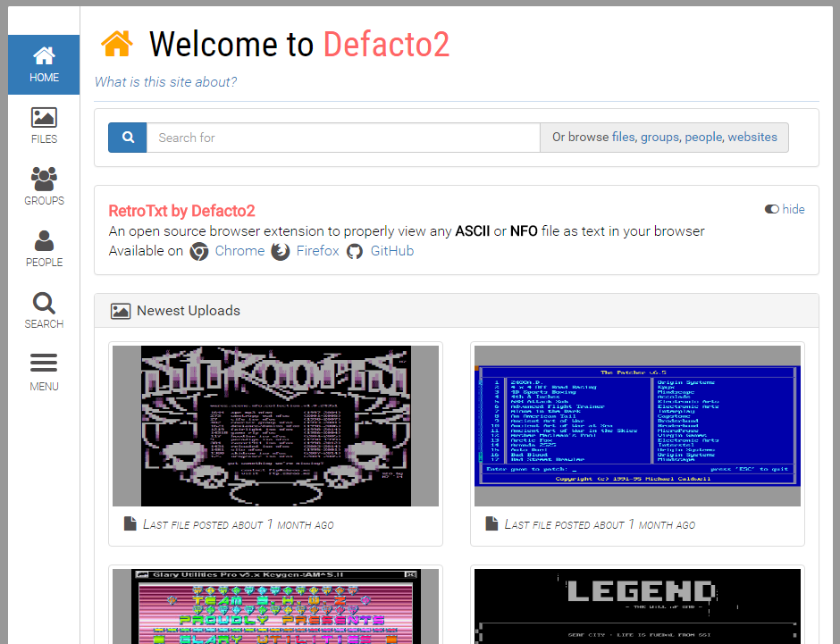

# Defacto2

## [defacto2.net](https://defacto2.net)

Task, bug tracker repository and wiki for the Defacto2 website.

### [New features](https://github.com/Defacto2/defacto2-website/releases)
To see what new code and features have been implemented on the site.

### [Issues](https://github.com/Defacto2/defacto2-website/issues/new)
If you have discovered a bug with the site it would be a great help if you could report it!

### [Data corrections](https://github.com/Defacto2/defacto2-website/issues?milestone=4&state=open)
Any data corrections such as incorrect information on the *Art & files* can be reported here, please include a URL pointing to the item as the *Issue's* title.

### [Suggestions](https://github.com/Defacto2/defacto2-website/milestones)
Visit the milestones to see or suggest future enhancements and ideas for the site.

